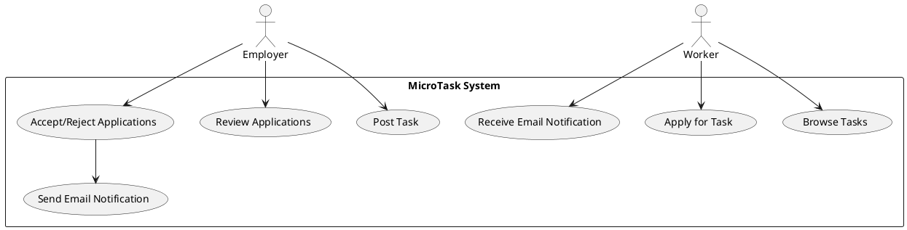

# MicroTask - Task Management Platform

MicroTask is a task management platform designed to connect employers and workers, enabling them to collaborate effectively. This project is built using **Spring Boot**, **MongoDB**, and follows a modular architecture to ensure scalability and maintainability.

---

## 📑 Table of Contents

1. [Project Overview](#project-overview)
2. [Features](#features)
3. [Technologies Used](#technologies-used)
4. [Database Schema](#database-schema)
5. [Use Case Diagram](#use-case-diagram)
6. [Getting Started](#getting-started)
7. [Endpoints](#endpoints)
8. [Testing](#testing)
9. [Future Enhancements](#future-enhancements)
10. [Contributors](#contributors)

---

## 📘 Project Overview

MicroTask is a web-based application that allows users to:
- Post tasks as employers.
- Apply for existing tasks as workers.
- Manage task applications (accept or reject).
- Notify users via email for critical task-related actions (e.g., application status updates).

The platform is designed to be modular and extensible, enabling future integration with advanced features like analytics and multilingual support.

---

## ✨ Features

### **1. Task Management**
- Employers can create, update, and delete tasks.
- Workers can browse tasks and apply.

### **2. Application Management**
- Employers can review, accept, or reject applications.
- Workers are notified about their application status.

### **3. Notification System**
- Notifications are sent via email for:
  - New applications.
  - Application acceptance or rejection.
  - Task completion or cancellation.

### **4. Database Integration**
- Uses MongoDB to store task, application, and notification data.

---

## 🛠️ Technologies Used

- **Backend**: Java, Spring Boot, Spring Data MongoDB
- **Database**: MongoDB
- **Email Service**: JavaMail (SMTP with Gmail)
- **Testing**: Postman
- **PlantUML**: For diagrams

---

## 🗂️ Database Schema

### Task Collection
```json
{
  "_id": "ObjectId('6783e44d72af58037beab619')",
  "title": "Custom Port Task",
  "description": "Testing MongoDB on custom port",
  "budget": 150,
  "category": "IT",
  "status": "OPEN",
  "deadline": "2025-01-31",
  "createdBy": "user123",
  "applications": [
    {
      "userId": "worker123",
      "message": "Interested in this task",
      "status": "PENDING"
    }
  ],
  "createdAt": "2025-01-12"
}
```

### Notification Collection
```json
{
  "_id": "unique_id",
  "userId": "user123",
  "email": "user123@example.com",
  "message": "Your application has been accepted.",
  "type": "CANDIDATURE_ACCEPTED",
  "timestamp": "2025-01-14T12:00:00Z",
  "read": false
}
```

---

## 🖼️ Use Case Diagram

The following diagram outlines the main interactions between users and the MicroTask platform:



To render this diagram, use a PlantUML-compatible viewer or tool (e.g., IntelliJ IDEA plugin, Visual Studio Code).

---

## 🚀 Getting Started

### Prerequisites
1. Java 17 or later installed.
2. MongoDB installed and running on port `28000`.
3. Gmail account with application-specific password enabled.

### Installation
1. Clone the repository:
   ```bash
   git clone https://github.com/your-repo/microtask.git
   cd microtask
   ```
2. Configure the database connection in `application.properties`:
   ```properties
   spring.mail.username=your_email@gmail.com
   spring.mail.password=your_app_password
   spring.data.mongodb.uri=mongodb://localhost:28000/microtasks
   ```
3. Build and run the project:
   ```bash
   mvn clean install
   mvn spring-boot:run
   ```

---

## 🌐 Endpoints

### **Task Management**
| Method | Endpoint                | Description                |
|--------|-------------------------|----------------------------|
| POST   | `/api/tasks`            | Create a new task          |
| GET    | `/api/tasks`            | Get all tasks              |
| GET    | `/api/tasks/{id}`       | Get task by ID             |
| DELETE | `/api/tasks/{id}`       | Delete a task              |

### **Application Management**
| Method | Endpoint                                        | Description                         |
|--------|------------------------------------------------|-------------------------------------|
| POST   | `/api/tasks/{id}/apply`                        | Apply for a task                   |
| PATCH  | `/api/tasks/{id}/applications/{userId}/status` | Update application status          |

---

## 🔧 Testing

Use **Postman** to test the API functionality. Example test cases include:
- Creating a task and verifying it in MongoDB.
- Applying for a task and checking if the notification is sent.
- Accepting or rejecting an application and verifying the email.

---

## 🛠️ Future Enhancements

1. **Frontend Integration**: Develop a modern UI using React or Angular.
2. **User Authentication**: Add roles for employers and workers.
3. **Analytics Dashboard**: Provide statistics on tasks and applications.
4. **Multilingual Support**: Enable dynamic language switching.

---

## 👥 Contributors

- **BADREDDINE ACHRAF** - Task Management, Notification System


