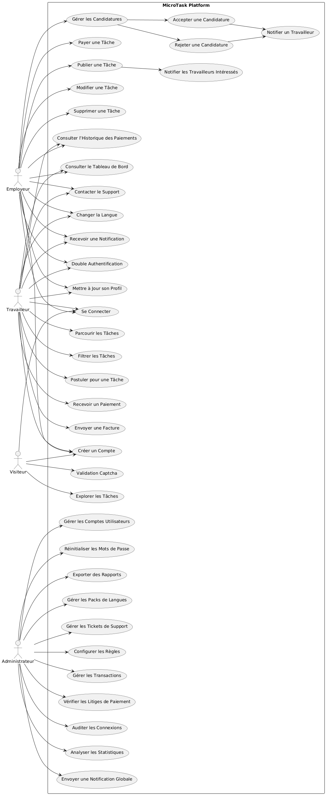

# **MicroTask - Plateforme de freelance**

## **Description**
MicroTask est une plateforme qui connecte employeurs et travailleurs pour collaborer efficacement sur des micro-tâches. Le projet inclut des fonctionnalités essentielles telles que la gestion des utilisateurs, la publication et le suivi des tâches, un paiment sécurisé , ainsi qu'un système de notification automatisé.

---

## **Table des Matières**
1. [Aperçu du Projet](#aperçu-du-projet)
2. [Fonctionnalités](#fonctionnalités)
3. [Technologies Utilisées](#technologies-utilisées)
4. [Schéma de la Base de Données](#schéma-de-la-base-de-données)
5. [Diagramme de Cas d'Utilisation (PlantUML)](#diagramme-de-cas-dutilisation-plantuml)
6. [Installation et Configuration](#installation-et-configuration)
7. [Endpoints](#endpoints)
8. [Testing](#testing)
9. [Bonnes Pratiques et Sécurité](#bonnes-pratiques-et-sécurité)
10. [Problémes Rencontrés](#Problémes-Rencontrés)
11. [Contributeurs](#contributeurs)

---

## **Aperçu du Projet**
MicroTask permet aux utilisateurs de :
- **Employeurs** : Publier des tâches, gérer les candidatures, notifier les candidats sélectionnés  et payer en toute sécurité les travailleurs.
- **Travailleurs** : Parcourir les tâches disponibles, postuler et suivre leurs candidatures.

Le projet respecte les principes de modularité, de sécurité, et de scalabilité pour permettre une intégration future de nouvelles fonctionnalités comme des tableaux de bord analytiques ou un support multilingue.

---

## **Fonctionnalités**

### **1. Gestion des Utilisateurs**
- Inscription sécurisée avec confirmation par e-mail.
- Connexion protégée avec des mots de passe hachés via BCrypt.
- Réinitialisation des mots de passe avec un jeton temporaire.
- Récupération des informations utilisateur via API REST.

### **2. Gestion des Tâches**
- Publication de tâches par les employeurs (titre, description, budget, catégorie, délais).
- Consultation et candidature pour des tâches par les travailleurs.
- Mise à jour du statut des candidatures (acceptées, rejetées).

### **3. Notifications Automatisées**
- Notifications par e-mail pour :
  - Confirmation d'inscription.
  - Changement de statut des candidatures.
  - Suppression ou modification des tâches.

### **4. Traitement Sécurisé des Paiements**

- Utilise l'API Stripe Payment Intents pour des transactions sécurisées.
- Gère les paiements tokenisés pour une sécurité accrue.

### **5. Support Multi-Devises et confirmation en temps réél**
- Les paiements peuvent être effectués dans diverses devises en fonction de la configuration de la plateforme.
- Le statut des paiements est mis à jour en temps réel, garantissant un retour immédiat pour les employeurs et les travailleurs.

### **Note**  
Cette implémentation utilise **le mode test de Stripe** pour toutes les opérations liées aux paiements. Aucune transaction financière réelle n'est effectuée. Le tableau de bord Stripe Test est accessible à [Stripe Test Dashboard](https://dashboard.stripe.com/test).


---

## **Technologies Utilisées**

### **Backend**
- **Java** : Spring Boot pour la gestion des API REST.
- **Spring Security** : Authentification et autorisation.
- **Spring Data JPA** : Gestion des données relationnelles.
- **Stripe** : API de paiement (Payment Intents et Elements)

### **Frontend**
- **React** : framework javascript.
- **TailwindsCSS** framework css.

### **Base de Données**
- **PostgreSQL** : Pour les utilisateurs.
- **MongoDB** : Pour les tâches et les notifications.

### **Services Complémentaires**
- **JavaMail** : Envoi d’e-mails via SMTP.
- **Outils de test** : Postman, Tableau de bord Stripe Test

---

## **Schéma de la Base de Données**

### Utilisateurs (PostgreSQL)
```sql
CREATE TABLE users (
    id SERIAL PRIMARY KEY,
    email VARCHAR(255) UNIQUE NOT NULL,
    password VARCHAR(255) NOT NULL,
    first_name VARCHAR(100),
    last_name VARCHAR(100),
    roles VARCHAR(255),
    created_at TIMESTAMP DEFAULT NOW()
);
```

### Tâches et Notifications (MongoDB)
#### Collection `tasks`
```json
{
  "_id": "ObjectId('6783e44d72af58037beab619')",
  "title": "Créer une API REST",
  "description": "Développer une API pour la gestion des utilisateurs",
  "budget": 200,
  "status": "OUVERT",
  "createdBy": "user123",
  "applications": [
    {
      "userId": "worker123",
      "message": "Je suis intéressé",
      "status": "EN_ATTENTE"
    }
  ]
}
```

#### Collection `notifications`
```json
{
  "_id": "unique_id",
  "userId": "user123",
  "email": "user123@example.com",
  "message": "Votre candidature a été acceptée.",
  "type": "CANDIDATURE_ACCEPTEE",
  "timestamp": "2025-01-14T12:00:00Z",
  "read": false
}
```

---

## Diagramme de Cas d'Utilisation
Voici un diagramme décrivant les interactions principales dans la plateforme **MicroTask** :



---

## **Installation et Configuration**

### **Prérequis**
- Java 17 ou plus récent.
- PostgreSQL et MongoDB installés et configurés.
- Maven pour gérer les dépendances.

### **Étapes**
1. **Cloner le projet :**
   ```bash
   git clone https://github.com/username/microtask.git
   cd microtask
   ```

2. **Configurer les bases de données :**
   Modifiez `application.properties` :
   ```properties
   spring.datasource.url=jdbc:postgresql://localhost:5432/microtask
   spring.datasource.username=postgres
   spring.datasource.password=motdepasse
   spring.data.mongodb.uri=mongodb://localhost:27017/microtask
   ```

3. **Lancer le backend :**
   ```bash
   mvn clean install
   mvn spring-boot:run
   ```

4. **Lancer le frontend :**
   ```bash
   npm start
   ```
---

## **Endpoints**

### **Gestion des Utilisateurs**
| Méthode | Endpoint                   | Description                |
|---------|----------------------------|----------------------------|
| POST    | `/api/users/register`      | Inscrire un utilisateur    |
| POST    | `/api/users/login`         | Connecter un utilisateur   |
| POST    | `/api/users/forgot-password` | Réinitialiser le mot de passe |
| GET     | `/api/users/{email}`       | Récupérer un utilisateur   |

### **Gestion des Tâches**
| Méthode | Endpoint                | Description                |
|---------|-------------------------|----------------------------|
| POST    | `/api/tasks`            | Créer une tâche            |
| GET     | `/api/tasks`            | Consulter les tâches       |
| PATCH   | `/api/tasks/{id}/status`| Mettre à jour le statut    |
| DELETE  | `/{id}/applications/{userId}`| Supprimer une tâche   |

### **Gestion des paiements**
| Méthode | Endpoint                   | Description                |
|---------|----------------------------|----------------------------|
| POST    | `/api/payments/create`     | Crée une intention de paiement    |
| POST    | `/api/payments/confirm`    | Confirme un paiement   |

### **Pages Frontend**
| **Route**         | **Description**                                             |
|-------------------|-------------------------------------------------------------|
| `/`               | **Dashboard** : Page d'accueil affichant un aperçu général des tâches et notifications. |
| `/post-task`      | **Post Task** : Page permettant aux employeurs de publier de nouvelles tâches. |
| `/search-tasks`   | **Search Tasks** : Page pour les travailleurs afin de rechercher des tâches disponibles. |
| `/my-tasks`       | **My Tasks** : Page où les utilisateurs peuvent gérer leurs propres tâches (créées ou acceptées). |
| `/profile`        | **Profile** : Page de gestion des informations personnelles et des paramètres du profil utilisateur. |
| `/checkout`       | **Checkout** : Page permettant aux employeurs de payer pour une tâche terminée. |
| `/confirmation`   | **Confirmation** : Page affichant le statut du paiement après son traitement. |


---

## **Testing**

**Cartes de Test Stripe**
   - **Paiement Réussi** : `4242 4242 4242 4242` (Visa)
   - **Carte Refusée** : `4000 0000 0000 0002`
   - **Fonds Insuffisants** : `4000 0000 0000 9995`
   - **Carte Expirée** : `4000 0000 0000 0069`
   - **CVC Incorrect** : `4000 0000 0000 0127`
   - **Carte Volée** : `4000 0000 0000 9979`
   - **Authentification 3D Secure Requise** : `4000 0027 6000 3184`

   **Date d’expiration** : Toute date future (par ex. `12/34`)  
   **CVC** : Trois chiffres quelconques (par ex. `123`)

---

## **Problémes Rencontrés**
- En raison d'un manque de temps, nous n'avons pas pu mettre en œuvre le processus de paiement des travailleurs ni connecter le backend du système de paiement avec le prix exact de chaque tâche.
- Dans le cadre des tests liés à l’acceptation et au refus des candidatures pour les tâches, les adresses email utilisées sont actuellement définies de manière statique dans le code backend. Cette décision a été prise par manque de temps pour intégrer les données emails provenant du module de gestion des utilisateurs développé par Reda. Bien que cette implémentation soit temporaire, elle permet de valider les fonctionnalités critiques en attendant une future mise à jour qui assurera l’intégration dynamique des emails depuis le système de gestion des utilisateurs.


---

## **Bonnes Pratiques et Sécurité**
- Hachage des mots de passe avec **BCrypt**.
- Utilisation de **Spring Security** pour protéger les endpoints.
- Respect des principes **SOLID** et **Clean Code**.
- Gestion des configurations sensibles via variables d'environnement.
- Tokenizaton des donnés bancaires avec **Stripe** pour qu'elles ne soit pas visibles.

---

## **Contributeurs**
- **Badreddine Achraf** - Gestion des tâches : 
      badreddineachraf03@gmail.com
- **Barakat Adnane** - Gestion des paiements :
      adnanebarakat3@gmail.com
- **El Maghnaouy Reda** - Gestion des utilisateurs :
    redamaghnawi1@gmail.com
- **Sait Yassine** - Developpement UI :
    
